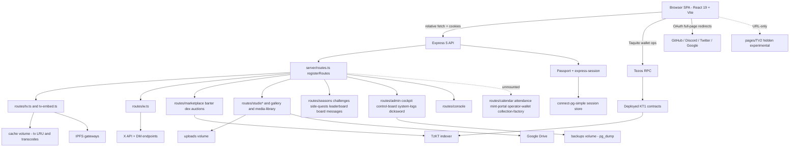

# WTF App Structure And Interconnectivity Map

**Status**: Living document. Update on every architectural change.
**Pre-stabilization HEAD on `main`**: `13d2d231978ed6c53a549b355cdd737ee4598b7b` (before this commit).
**Restore tag**: `pre-stabilization-2026-04-28` (annotated, pushed to `origin`, points at clean-tree commit `da9ba05`).
**Working branch**: `chore/structure-map-and-vite-contracts`.
**Map written**: 2026-04-28.

This document is the rule book for "where does X live and what does it touch." If the map and the code disagree, the code wins, but the next person to read this map should fix it before they ship anything.

---

## 1. Repository topology

This is **not a single repo**. Restoring or branching has to happen in the right one.

| Role | Path | Remote / nature |
| --- | --- | --- |
| Parent meta-repo | `/Users/joshuafarnworth/Desktop/cursor-projects/Sandbox` | Tracks submodule pointers only |
| WTF web app (this repo) | `WTF combo/WTF` | `https://github.com/Paulwhoisaghostnet/WTF.git` — submodule, parent expects branch `codex/wtf-ecosystem-followups`, working tree currently lives on `main` (pre-existing drift, not fixed here) |
| SmartPy compile/origination service | `WTF combo/building/shadownet kiln` | `https://github.com/Paulwhoisaghostnet/kiln.git` — sibling submodule, referenced from this repo via `KILN_API_URL` |
| Tezos data sibling | `WTF combo/wtf tez/wtf.tez` | `https://github.com/Paulwhoisaghostnet/wtf.tez.git` — sibling submodule, out of scope here |
| In-repo Discord bot | `WTF combo/WTF/extensions/wtf-gameshow-bot` | Standalone Node package, separate process, **not** bundled into the web app |
| Out-of-repo Discord bots | `WTF combo/building/Discord Bots` | Adjacent toolkit, not a submodule |

### Clone-from-scratch DR

```bash
git clone https://github.com/Paulwhoisaghostnet/WTF.git
cd WTF
git checkout pre-stabilization-2026-04-28
```

---

## 2. Build and deploy pipeline (read before changing any path here)

| Stage | Source of truth | Triggers |
| --- | --- | --- |
| Local dev | `npm run dev` → `tsx server/index.ts` (Vite middleware in dev mode via `server/vite.ts`) | Manual |
| Local build | `npm run build` → `vite build && esbuild server/index.ts ...` writes `dist/public` (SPA) and `dist/index.cjs` (server) | Manual |
| Local production start | `npm run start` → `NODE_ENV=production node dist/index.cjs` | Manual |
| Production deploy | `.github/workflows/deploy.yml` | **Push to `main`**. Tag pushes do **not** trigger deploy. |

The deploy workflow SSHes to Hetzner, `git fetch origin && git reset --hard origin/main`, rebuilds the Docker image with `--no-cache`, applies `drizzle/cockpit_all.sql`, then every numbered SQL migration `0015+` in lexical order, then `npx drizzle-kit push --force`, then restarts the app, then health-checks `http://localhost:3000/api/health` until status is `ok` (5 retries, 10s apart).

### Build context warning (former root cause of "Vite can't find contracts" in prod — now fixed in this commit chain)

Original problem: `Dockerfile` builder stage ran `COPY . . && RUN npm run build`. `.dockerignore` excludes `.env` and `.env.*`. `deploy.yml` did **not** pass `--build-arg VITE_*`. Therefore the production SPA was rebuilt without `VITE_MARKETPLACE_CONTRACT_ADDRESS` or `VITE_BARTER_CONTRACT_ADDRESS` regardless of what was in the prod server's `.env`. The runtime container had the env, but Vite already baked the empty strings into the JS bundle by the time the container started. Local `npm run dev` worked because `vite.config.ts` calls `dotenv` on the repo root `.env`.

Fix landed (Plan D, commit on this branch):

- `Dockerfile` builder stage declares `ARG VITE_MARKETPLACE_CONTRACT_ADDRESS=` and `ARG VITE_BARTER_CONTRACT_ADDRESS=`, then exports them as `ENV` so the `npm run build` invocation in the same stage sees them in `process.env`.
- `.github/workflows/deploy.yml` `set -a; . ./.env; set +a` before `docker compose build`, then passes the two values via `--build-arg`.

These KT1 addresses are public on-chain identifiers, not secrets. The change is invariant for anyone whose `.env` does not have those keys (the values default to empty, matching pre-Plan-D behavior).

---

## 3. Frozen contracts (do not touch in any plan that does not explicitly target them)

Edits to anything in this list are forbidden without an explicit, separate plan and re-approval. Any of these surfaces failing silently can lock users out, leak secrets, or corrupt persisted OAuth tokens.

### Auth, session, OAuth

- `server/app.ts` — `setupAuth` registration, CORS, helmet/CSP, rate limiters, `MEDIA_RATE_LIMIT_BYPASS_PREFIXES`
- `server/auth/passport.ts`, `server/auth/routes.ts`, `server/auth/oauth-base.ts`, `server/auth/oauth-crypto.ts`, `server/auth/session-secret.ts`, `server/auth/storage.ts`
- `server/websocket.ts` — cookie unsigning must stay aligned with HTTP session secret
- `server/lib/x-oauth2.ts`, `server/lib/x-dm-sync.ts`
- `server/routes/studio-admin.ts`, `server/routes/studio-drive.ts`, `server/lib/studio/user-drive.ts`, `server/lib/studio/platform-drive.ts`, `server/lib/studio/drivers/google-drive-client.ts`

### Data and deploy shape

- `shared/schema.ts` (read-only for mapping)
- `drizzle/`, `drizzle.config.ts`
- `Dockerfile`, `docker-compose.yml`, `.dockerignore`, `Caddyfile`, `docker-entrypoint.sh`, `.github/workflows/deploy.yml`

### Adjacent processes

- `extensions/wtf-gameshow-bot/` — its own package, separate Node process, separate `.env`

### Unmounted routers (mounting one is itself an API-surface change)

- `server/routes/calendar.ts`, `server/routes/attendance.ts`, `server/routes/mint-portal.ts`, `server/routes/operator-wallet.ts`, `server/routes/collection-factory.ts`

---

## 4. Module ownership

Every module lists: owned UI routes, owned API routes, schema tables touched (informative — shared schema is the single source), caches/volumes, background jobs, external integrations, and trust boundary.

### 4.1 Auth (cross-cutting, frozen)

| Field | Value |
| --- | --- |
| UI | `client/src/pages/Login.tsx`, `Register.tsx`, `Profile.tsx` (OAuth links), `Landing.tsx`, `client/src/lib/auth-context.tsx`, `wallet-context.tsx` |
| API | `server/auth/routes.ts` mounted via `registerRoutes()`. Endpoints listed in section 6.1 |
| Schema | `users`, `walletAuthNonces` |
| Volumes | None |
| Background jobs | Post-auth `refreshDossierInBackground` enqueues wallet indexing |
| External | GitHub OAuth, Discord OAuth (verification + Linked Roles), Twitter 1.0a (link), Twitter OAuth2 (login + DMs), Google OAuth (Studio only), Postgres session store via `connect-pg-simple` |
| Trust | Session cookie + HMAC. WebSocket reuses same secret. OAuth state lives in session and depends on durable session writes before redirects |

### 4.2 Gameshow core

| Field | Value |
| --- | --- |
| UI | `Dashboard.tsx`, `Rounds.tsx`, `RoundDetail.tsx`, `Challenges.tsx`, `SideQuests.tsx`, `Leaderboard.tsx`, `MessageBoard.tsx`, `Messages.tsx`, `Faq.tsx`, `Links.tsx`, `WtfRecapture.tsx` |
| API | `server/routes/seasons.ts`, `challenges.ts`, `side-quests.ts`, `leaderboard.ts`, `board.ts`, `messages.ts`, `faq.ts`, `links.ts`, `wtf-recapture.ts`, `notifications.ts` |
| Schema | `seasons`, `challenges`, `xpEvents`, `messages`, plus join tables |
| Volumes | None |
| Background jobs | Scheduler in `server/lib/background-jobs.ts` |
| External | None first-party |
| Trust | Most routes are auth-required; `/leaderboard`, `/links`, `/faq`, `/messageboard`, `/wtf-recapture` are public per `PAGE_DEFS` |

### 4.3 WTF TV (microapp — high abuse surface)

| Field | Value |
| --- | --- |
| UI | `client/src/pages/TV.tsx`, hidden experimental `client/src/pages/TV2.tsx` (URL-only, no start menu / desktop icon) |
| API | `server/routes/tv.ts` (mounted), `server/routes/tv-embed.ts` (mounted, public surface), boot/migration in `server/index.ts` and `server/lib/tv-boot-backfill.ts` |
| Schema | `tvChannels`, `tvPlaylists`, `tvPlaylistItems` |
| Volumes | `cache` Docker volume → `/app/cache/tv` (LRU IPFS cache + transcodes; default 10 GB) |
| Background jobs | `tv-cache-evict` scheduled job; on-boot backfill |
| External | IPFS gateways (host allowlist via `TV_CACHE_ALLOWED_HOSTS`), ffmpeg for transcodes |
| Trust | **Authoritative ownership = DB `tvChannels.ownerUserId`**, never a client-sent flag. Edit gate `ensureChannelEditable(channelId, user)` in `server/routes/tv.ts` (~line 805) checks owner OR `isStaffRole`. View gate `canViewChannel(channel, user, opts)` (~line 787). Private channels return 404 (not 403) on stream lookup to avoid existence disclosure |

**TV trust-boundary notes (review before any edit to `tv.ts`)**:

- `/api/tv/cache/media` and `/api/tv/cache/prefetch` are unauthenticated by design (playback fan-out). They rely on `normalizeMediaUri` → `normalizePublicHttpUrl(..., TV_CACHE_ALLOWED_HOSTS)` for SSRF defense. Prefetch can queue up to 10 URLs at a time — DoS-shape risk.
- `/api/tv/cache/stats` is staff-only.
- `/api/tv/playback/events` and `/api/tv/telemetry/item-end` are unauthenticated. Telemetry feeds an in-memory video blacklist; abuse can skew but not authorize.
- `/api/tv/playlist-items/:itemId/duration` is **now** authenticated and owner-checked. The code comment documents that it was previously unauthenticated (IDOR). Do not regress.
- The generic `/api/*` rate limiter has bypass prefixes for `/api/tv/cache/`, `/api/tv/channels/`, `/api/tv/bumpers/`, `/api/tv/stream/`, `/api/media/`, `/api/uploads/` (see `MEDIA_RATE_LIMIT_BYPASS_PREFIXES` in `server/app.ts`). These are intentional, but it means abuse needs to be addressed inside the route handler, not at the limiter.

### 4.4 W microapp

| Field | Value |
| --- | --- |
| UI | `client/src/pages/W.tsx` |
| API | `server/routes/w.ts` |
| Schema | `wFeedCache`, `xDmEvents`, `xDmConversations`, `xDmParticipants` |
| Volumes | None |
| Background jobs | `server/lib/x-dm-sync.ts` workers (groupchat / users / backfill), token refresh logic in `server/lib/x-oauth2.ts` |
| External | X (Twitter) OAuth2 + REST, X DM API |
| Trust | Per `LESSONS_LEARNED.md` 2026-04-28: platform tokens MUST NOT be used as fallback on user-facing DM routes. DM rate-limit circuit breaker is shared across the three sync jobs. DB-first reads — never short-circuit because token is missing |

### 4.5 Market and on-chain

| Field | Value |
| --- | --- |
| UI | `client/src/pages/Marketplace.tsx`, `Swap.tsx`, `TradeBoards.tsx`, `Hoard.tsx`, plus shared components in `client/src/components/` |
| API | `server/routes/marketplace.ts`, `barter.ts`, `dex.ts`, `wtf-auctions.ts`, `buyback-windows.ts`, `wtf-recapture.ts`, `portfolio.ts`, `contract-activity.ts`, `wallets.ts` |
| Schema | `walletEvents`, `walletSyncCursors`, `walletHoldings`, `marketplaceListings`, `marketplaceBids`, `contractMetadata`, `tokenMetadata`, `tokenSales`, `tokenListings`, `tokenMintEvents`, `tokenMarketSummary`, `xtzUsdDaily`, `contractActivityLogs`, `tokenGates` |
| Volumes | None |
| Background jobs | Wallet event indexing, token metadata sync, marketplace listing reconciliation |
| External | Tezos RPC (Taquito + Beacon/Octez.connect on the client), TzKT indexer (`getTzktBase()` in `server/lib/contract-config.ts`) |
| Client contract resolution | `client/src/lib/tezos/marketplace.ts` reads `import.meta.env.VITE_MARKETPLACE_CONTRACT_ADDRESS`. `client/src/lib/tezos/barter.ts` reads `import.meta.env.VITE_BARTER_CONTRACT_ADDRESS`. `WTF_TOKEN.contract` is hardcoded in `shared/types.ts` (network portability would require an ADR) |
| Server contract resolution | `server/lib/contract-config.ts` reads `MARKETPLACE_CONTRACT_ADDRESS` or `VITE_MARKETPLACE_CONTRACT_ADDRESS`, fails-closed in production, dev fallback to ghostnet KT1s |
| Trust | Network preflight (`client/src/lib/tezos/preflight.ts`) verifies wallet chain id matches expected before any signed op |

### 4.6 Studio / media

| Field | Value |
| --- | --- |
| UI | `Studio.tsx`, `StudioProject.tsx`, `MyVideos.tsx`, `MyPhotos.tsx`, `MyGallery.tsx`, `Gallery.tsx` |
| API | `server/routes/studio.ts`, `studio-files.ts`, `studio-annotations.ts`, `studio-admin.ts`, `studio-drive.ts`, `gallery.ts`, `media-library.ts` |
| Schema | `studioProjects`, `studioProjectMembers`, `studioFolders`, `studioFiles`, `studioFileVersions`, `studioAnnotations`, `studioAnnotationComments`, `studioUserState`, `studioStorageAccounts`, `studioPlatformStorage` |
| Volumes | `uploads` Docker volume → `/app/uploads/studio` |
| Background jobs | Drive sync via `server/lib/studio/user-drive.ts` and `platform-drive.ts` |
| External | Google Drive (per-user OAuth and platform OAuth), local upload storage |
| Trust | `studioMemberRoleEnum` includes "owner" — note this is **Studio member ownership**, completely separate from `tvChannels.ownerUserId`. Cross-checked permissions in `server/lib/studio/access.ts` |

### 4.7 Console / DOS games

| Field | Value |
| --- | --- |
| UI | `client/src/pages/Console.tsx` |
| API | `server/routes/console.ts` |
| Schema | None primary (uses `users` for high scores) |
| Static | `public/games/`, `dist/public/games/` (SPA build), `_vendor/js-dos`, installed cartridges in `dist/public/games/installed/` |
| Volumes | None |
| External | None (cartridges are pre-installed via `scripts/install-games.mjs`) |
| Trust | Path-scoped CSP override in `server/app.ts` for `/games/installed` allows `'unsafe-eval'`, `blob:`, `worker-src`. Cartridges run in sandboxed iframes |

### 4.8 Desktop shell

| Field | Value |
| --- | --- |
| UI | `client/src/components/layout/Desktop.tsx`, `client/src/lib/window-context.tsx`, `App.tsx` `PAGE_DEFS` |
| API | `server/routes/desktop.ts`, `server/routes/desktop-apps.ts`, `server/routes/profile.ts` |
| Schema | `users` (per-user settings) |
| Volumes | None |
| External | None |
| Trust | Auth-required for personalization endpoints |

### 4.9 Admin / ops / dicksword

| Field | Value |
| --- | --- |
| UI | `client/src/pages/Admin.tsx`, `Dicksword.tsx`, `DiscordLegal.tsx`, `PublicProfile.tsx` |
| API | `server/routes/admin.ts`, `system-logs.ts`, `cockpit.ts`, `control-board.ts`, `dicksword.ts` |
| Schema | `xpEvents`, system log tables |
| Volumes | `backups` Docker volume → `/app/backups` (pg_dump output, 7-day retention) |
| Background jobs | Scheduler, system-log middleware |
| External | Discord (linked roles, gameshow bot integration) |
| Trust | Role gate on `/admin` route via `roles: ["admin", "host", "cohost"]` in `PAGE_DEFS`. Server re-checks role in `admin.ts` |

---

## 5. Registry diff (UI vs API)

### 5.1 UI pages

`PAGE_DEFS` in `client/src/App.tsx` registers 36 patterns (including `/login`, `/register`, `/`). Comparing to the 39 files under `client/src/pages/`:

| Page file | Registered? | Notes |
| --- | --- | --- |
| `Landing.tsx`, `Login.tsx`, `Register.tsx` | Yes (full-screen overlay, not in `PAGE_DEFS` but handled in `AppContent`) | OK |
| All gameshow pages | Yes | OK |
| `TV.tsx`, `TV2.tsx`, `Console.tsx` | Yes (`TV2` hidden — URL-only access) | OK |
| `OperatorWallet.tsx` | **No (orphan)** | No URL pattern; cannot be opened from start menu or URL bar. Server route `operator-wallet.ts` is also unmounted. |
| `MintPortal.tsx` | **No (orphan)** | Pair with unmounted `mint-portal.ts`. |
| `Calendar.tsx` | **No (orphan)** | Pair with unmounted `calendar.ts` (which already has 9 routes including `/api/calendar/feed.ics` ICS feed). |
| `ControlBoard.tsx` | **Yes (`/control-board`)** | Server route `control-board.ts` is mounted; UI registered for `admin`/`host`/`cohost` in `PAGE_DEFS` (`Gameshow Control`). |
| `ContractFactory.tsx` | **No (orphan)** | Pair with unmounted `collection-factory.ts`. |

**Decision recorded**: Do not register orphan pages or mount their backends in this plan. Both halves of each pair must be reviewed together (security + product) in a follow-up plan because every newly-routed page becomes a public-or-auth surface that needs to be reasoned about end-to-end.

### 5.2 API routers

`registerRoutes(app)` in `server/routes.ts` mounts 35 routers + `/api/health` + `/api/health/disk`. The 5 unmounted route files are listed in the frozen-contracts section. Mounting them is a separate plan because:

1. They appear when the agent runs `app.use(...)` on a router whose endpoints might not have permission/role gates yet.
2. They may share schema tables that other code already persists (e.g. `attendance`, `calendar`) — turning on writes without coordinating with downstream readers risks data drift.

---

## 6. External services and env contract

| Service | Env keys (names only) | Where consumed |
| --- | --- | --- |
| Postgres | `DATABASE_URL`, `POSTGRES_PASSWORD` | App + scripts; `docker-compose.yml` builds `DATABASE_URL` for the `app` container |
| Supabase off-site backups | `VITE_SUPABASE_URL`, `VITE_SUPABASE_PUBLISHABLE_DEFAULT_KEY` (client), platform key (server) | `dist/run-supabase-backup.cjs` |
| GitHub OAuth | `GITHUB_CLIENT_ID`, `GITHUB_CLIENT_SECRET` | `server/auth/passport.ts` |
| Discord | `DISCORD_CLIENT_ID`, `DISCORD_CLIENT_SECRET`, gameshow bot token (in extension `.env`) | `server/auth/passport.ts`, `extensions/wtf-gameshow-bot/` |
| Twitter 1.0a (link) | `TWITTER_CONSUMER_KEY`, `TWITTER_CONSUMER_SECRET` | `server/auth/passport.ts` |
| Twitter OAuth2 (login + DM) | `TWITTER_OAUTH2_CLIENT_ID`, `TWITTER_OAUTH2_CLIENT_SECRET`, optional `TWITTER_OAUTH2_REDIRECT_URI`, optional `TWITTER_TOKEN_ENCRYPTION_KEY` | `server/auth/routes.ts`, `server/lib/x-oauth2.ts` |
| Google Drive (Studio) | `GOOGLE_CLIENT_ID`, `GOOGLE_CLIENT_SECRET`, redirect URIs `/api/studio/admin/drive/callback` and `/api/studio/drive/callback` | `server/lib/studio/drivers/google-drive-client.ts` |
| Tezos | `TEZOS_NETWORK`, `TEZOS_RPC_URL` (server), `MARKETPLACE_CONTRACT_ADDRESS`, `BARTER_CONTRACT_ADDRESS` (server), `VITE_MARKETPLACE_CONTRACT_ADDRESS`, `VITE_BARTER_CONTRACT_ADDRESS` (client, **must be present at `vite build` time, not just at runtime**) | `server/lib/contract-config.ts`, `client/src/lib/tezos/marketplace.ts`, `client/src/lib/tezos/barter.ts` |
| Kiln (SmartPy compile / origination) | `KILN_API_URL` (defaults to `http://host.docker.internal:3001`), `KILN_API_TOKEN`, `KILN_TIMEOUT_MS` | `server/routes/collection-factory.ts` (currently unmounted) |
| Site / TLS | `PUBLIC_SITE_URL`, `CORS_ALLOWED_ORIGINS`, `TRUST_PROXY`, `SITE_DOMAIN` | `server/app.ts` |
| TV cache | `TV_CACHE_DIR`, `TV_CACHE_MAX_AGE_DAYS`, `TV_CACHE_MAX_REMOTE_BYTES`, `TV_CACHE_MAX_TOTAL_BYTES`, `TV_CACHE_ALLOWED_HOSTS`, `TV_MEDIA_FETCH_TIMEOUT_MS`, `TV_TRANSCODE_ENABLED` | `server/routes/tv.ts` |

### 6.1 OAuth callback URLs (must stay registered with providers)

- `/api/auth/github/callback`
- `/api/auth/twitter/callback` (1.0a link flow)
- `/api/auth/twitter-oauth2/callback`
- `/api/auth/discord/callback`
- `/api/studio/admin/drive/callback`
- `/api/studio/drive/callback`

Changing route paths, host (via `PUBLIC_SITE_URL`), or `oauthCallbackUrl()` in `server/auth/oauth-base.ts` requires re-registering the URL with every affected provider console. **Do not "tidy" these.**

---

## 7. Volumes and durable state

| Volume | Path inside container | Backed up? | Reproducible? |
| --- | --- | --- | --- |
| `pgdata` | `/var/lib/postgresql/data` | Via `scripts/backup-db.sh` (pg_dump nightly into `backups`) | No — primary state |
| `uploads` | `/app/uploads` | Not in this repo's automation | No |
| `cache` | `/app/cache` (TV cache) | Not backed up | Yes — content-addressable; can be re-fetched |
| `backups` | `/app/backups` | Self (rotated 7 days) | No — but can re-take pg_dump |
| `caddy_data`, `caddy_config` | Caddy ACME state | No | Yes (will re-issue certs) |

A `git` rollback does **not** restore any of these volumes. Treat them as orthogonal state with their own restore procedures.

---

## 8. Backup, restore, and rollback recipes

Run from inside `WTF combo/WTF`.

### 8.1 Phase 0 backup (already done for this plan)

Done at 2026-04-28 ~01:50 PT:

- Tag `pre-stabilization-2026-04-28` on commit `da9ba05` (annotated, pushed to origin `fb7db9b`).
- Branch `chore/structure-map-and-vite-contracts` created from `main` (clean tree).
- DB backup: not run because the local Docker stack was not up. **Production deploy.yml does not invoke `backup-db.sh` automatically before the migration step — that is a known gap, document below.**

### 8.2 DB backup commands

Inside the running stack (preferred):

```bash
npm run backup:db
# == docker compose exec app bash /app/scripts/backup-db.sh
# Output: /app/backups/wtf_<timestamp>.dump (Docker volume `backups`, 7-day retention)
```

Manual fallback when the stack is down (host needs `postgresql-client-16` matching the server major):

```bash
pg_dump --format=custom --no-owner "$DATABASE_URL" > "wtf_$(date +%Y%m%d_%H%M%S).dump"
```

### 8.3 Rollback ladder (pick the lowest level that recovers you)

| Level | When | Command |
| --- | --- | --- |
| File | Single dirty change | `git checkout -- <path>` |
| Branch | Abandon the entire stabilization attempt | `git checkout main && git branch -D chore/structure-map-and-vite-contracts` |
| Repo | Bad commit on the branch | `git reset --hard pre-stabilization-2026-04-28` |
| Origin tag | Local disk loss | `git fetch --tags origin && git reset --hard pre-stabilization-2026-04-28` |
| Cold DR | Working dir gone | `git clone https://github.com/Paulwhoisaghostnet/WTF.git && git -C WTF checkout pre-stabilization-2026-04-28` |
| DB | Data corruption / regression | `pg_restore --clean --no-owner -d "$DATABASE_URL" /app/backups/wtf_<timestamp>.dump` |
| Submodule pointer | Parent repo confused | `git -C "Sandbox" submodule update --init --recursive` after restoring WTF |
| Production | Bad deploy | SSH to Hetzner, `cd /opt/platform/repos/wtf-app && git fetch --tags origin && git reset --hard pre-stabilization-2026-04-28 && docker compose build --no-cache app && docker compose up -d` |

---

## 9. Impact checklist (use this for every future change)

Before touching code, fill in every row. Empty rows are fine — explicit "none" is the value.

| Field | Value |
| --- | --- |
| What product surface does this change? | |
| Which UI route(s) (`PAGE_DEFS`)? | |
| Which API route(s) (`registerRoutes()`)? | |
| Schema tables touched? | |
| Migrations needed (`drizzle/` + idempotent SQL)? | |
| Caches / volumes touched? | |
| Background jobs touched? | |
| Auth / permission gates touched? | |
| External service contract touched (env, callback URL, scopes)? | |
| Build pipeline touched (Dockerfile, docker-compose, deploy.yml)? | |
| Frozen contract overlap (section 3 list)? If yes → require separate plan | |
| Restore tag for the change? | |
| Rollback command? | |

---

## 10. Known gaps and follow-up plans

The map captures the **current** state; it does not pretend things are good. The known gaps each map to a deferred plan:

- **Plan B — TV security audit response**: failing tests for IDOR on `/api/tv/playlist-items/:itemId/duration` (closed but should stay closed under refactor), channel slug collisions, private stream id-guessing, bumper pool leakage, unauthenticated cache prefetch abuse, telemetry blacklist abuse.
- **Plan C — Module folder extraction**: move TV / W / Market / Studio / Console / Gameshow / Admin into feature folders. Single atomic change; touches Vite aliases, tsconfig paths, esbuild externals, `server/routes.ts`, `client/src/App.tsx`.
- **Plan D — Docker build-arg propagation (LANDED in this branch)**: fixes "Vite can't find contracts" in production. Added `ARG VITE_MARKETPLACE_CONTRACT_ADDRESS` and `ARG VITE_BARTER_CONTRACT_ADDRESS` to the builder stage of `Dockerfile` with matching `ENV` exports, sourced them in `deploy.yml` via `set -a; . ./.env; set +a` before `docker compose build`, and passed them via `--build-arg`. Includes both flags defaulting to empty so a `.env` missing those keys produces the pre-Plan-D bundle (no regression).
- **Plan E — Auth/permission helper unification**: requires Plan B coverage to land first.
- **Plan F — Microapp data isolation**: separate caches and background-job queues for TV / W / Studio / Market.
- **Plan G — Orphan pair review**: per orphaned UI/API pair (`Calendar`+`calendar.ts`, `MintPortal`+`mint-portal.ts`, `OperatorWallet`+`operator-wallet.ts`, `ContractFactory`+`collection-factory.ts`), decide product intent and either register both halves or remove both halves. Do not partially register. (`ControlBoard` is registered at `/control-board`.)
- **Plan H — Auth event observability**: per `LESSONS_LEARNED.md`, the OAuth refresh and DM rate-limit work added structured events. Verify the `events` and `oauth_events` tables (or whichever sink) are queryable by ops, and add dashboards.

---

## 11. Race-condition watch list

Catalogued so future incidents can be cross-referenced quickly. None of these are addressed in this plan.

- TV cache fetch / transcode / temp-file finalization (`server/routes/tv.ts`).
- Session `req.session.save()` timing before OAuth redirects (Twitter OAuth2 callback explicitly works around this; do not remove the explicit save).
- Background wallet/dossier indexing kicked off post-auth.
- Contract activity ledger updates around wallet ops (`client/src/lib/tezos/activity-ledger.ts`).
- TV in-memory telemetry / blacklist eviction.
- DM sync token refresh races (per `LESSONS_LEARNED.md` 2026-04-28 entry on token rotation).

---

## 12. Top-level interconnectivity



---

## 13. Ground rules for next agent

Read these once per pass, not once per session.

1. Read `LESSONS_LEARNED.md` first. Violating a documented lesson is unacceptable.
2. Read `BUG_BOUNTY_BOARD.md` to check for active bounty items related to your task.
3. Before touching code, fill in section 9's impact checklist.
4. If your change overlaps section 3, **stop and write a separate plan**.
5. After completing a debugging or correction pass, append to `LESSONS_LEARNED.md`.
6. Never modify orphan pages or mount orphan routers as part of an unrelated change. Section 5 is the gate.
7. When in doubt about contract addresses in production, the issue is almost always Plan D (build-arg propagation), not the source files in `contracts/`.
